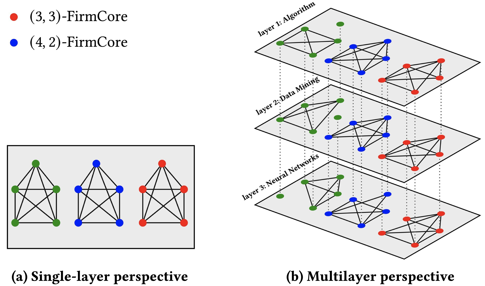

We present a new family of dense subgraphs in multilayer networks, and show that it satisfies many of the nice properties of $k$-cores. Also, it has a polynomial time algorithm, making it a powerful tool for understanding the structure of massive networks.

